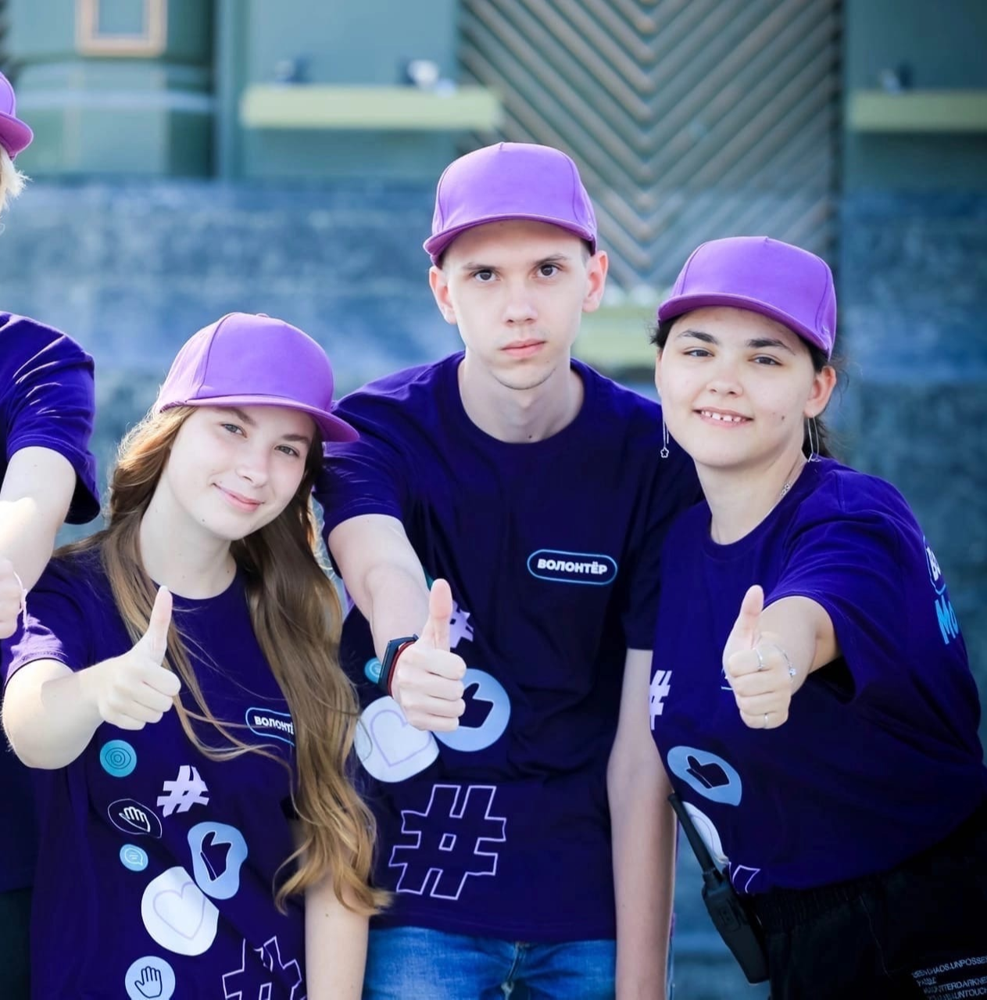

## 🌟 Интерактивная карта доступности для людей с ОВЗ

**Наша миссия:** Создать удобный сервис для связи людей с ограниченными возможностями здоровья и волонтёров через онлайн-карту.

### 🔹 Ключевые возможности:
- 📍 **Заявки на помощь** — люди с ОВЗ отмечают свои потребности на карте.
- 🏃 **Быстрый отклик** — волонтёры видят запросы рядом и могут помочь.
- 🤝 **Партнёрство** — сотрудничество с организацией «МосВолонтёр».
- 🎓 **Студенческий проект** — разработан в Московском Политехническом университете.

