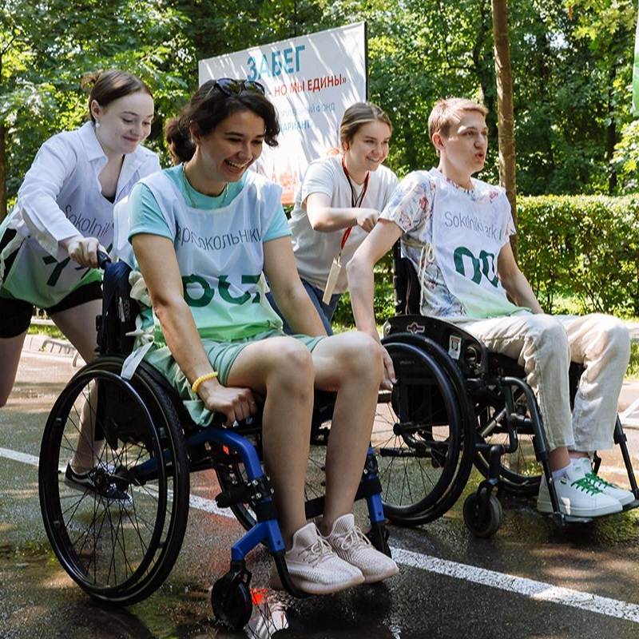

### 🌟 Инновационный проект

Наш сервис предлагает **уникальную онлайн-карту**, которая помогает людям с ограниченными возможностями здоровья (ОВЗ) оставлять заявки на получение услуг в их городе, а волонтёрам — быстро и удобно отслеживать нуждающихся поблизости.

---

### 🤝 Сотрудничество с МосВолонтёр

Для достижения максимальной эффективности и охвата мы сотрудничаем с организацией **МосВолонтёр**. Это партнерство позволяет:
- Привлекать волонтеров для помощи людям с ОВЗ.  
- Расширять сеть поддержки.  
- Обеспечивать широкий доступ к услугам.  

---

### ♿ Создание доступной среды

**Главная цель проекта** — создание доступной среды для людей с ОВЗ. Мы работаем над тем, чтобы:
- Нуждающиеся могли быстро получить помощь.  
- Волонтёры получали опыт взаимодействия с разными слоями населения.  

---

### 🎓 Сервис, созданный студентами

Проект разработан инициативной группой студентов **Московского Политехнического университета**, которые стремятся сделать мир более доступным. Молодые специалисты из разных областей объединили усилия для создания платформы, отвечающей актуальным запросам людей с ОВЗ.
